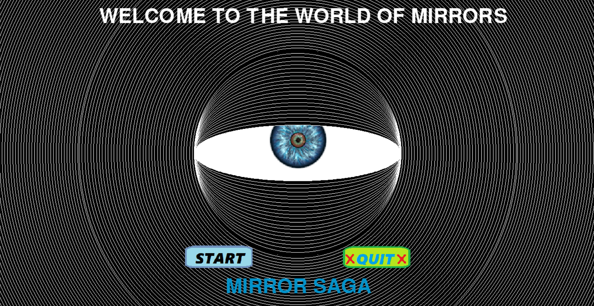
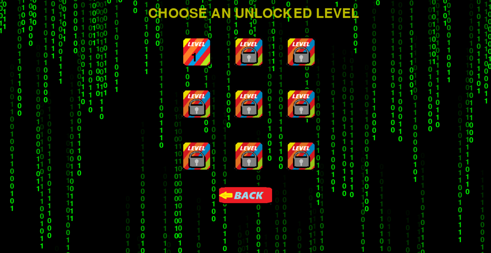
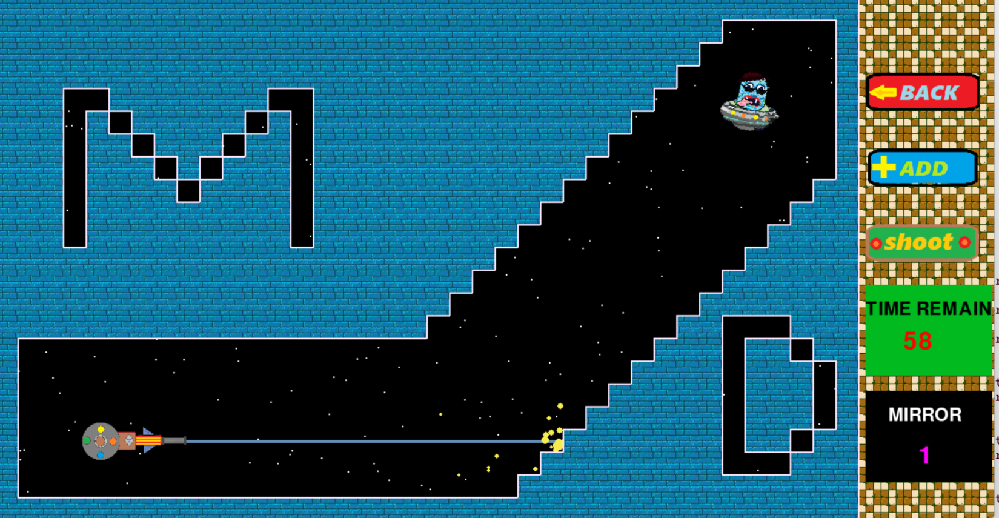
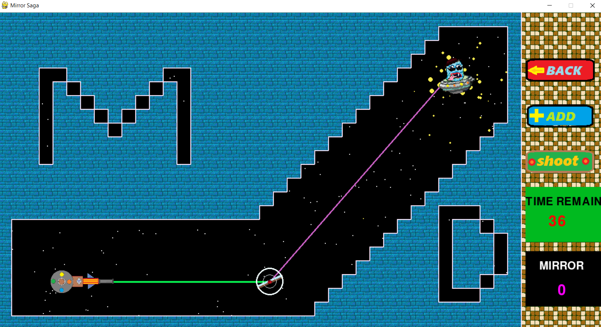
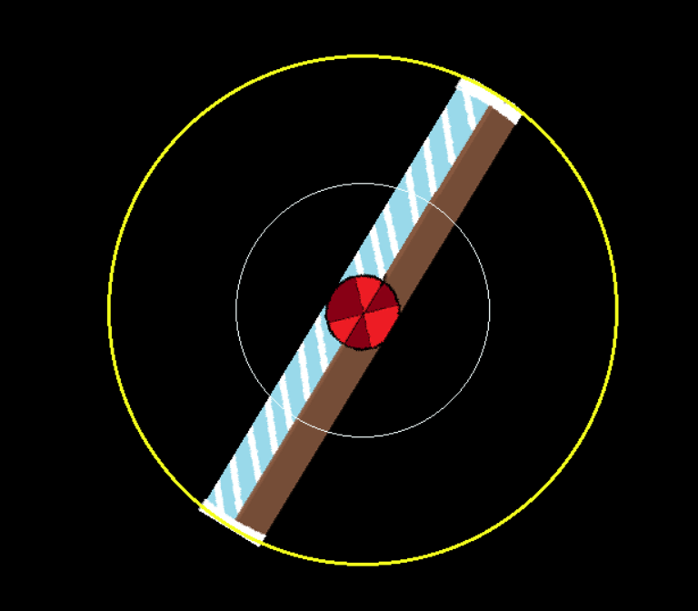
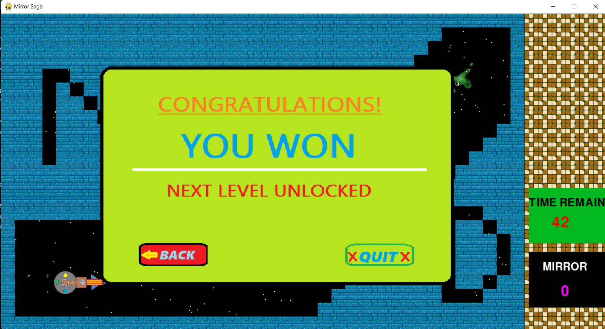

#**MIRROR SAGA**
-------------------------------
#What is this?
This is a ` space + mirror` gamemade `Mainak Deb`.
This game is made using python


#YOUTUBE PLAYLIST
CHANNEL NAME: [MAINAK DEB](https://www.youtube.com/channel/UC6zpwd4dQM8cYqzkeZjAmYg)

https://www.youtube.com/playlist?list=PLLw9HRvbUMhuhhino7JaT1kpUVlbH1h5E

[CLICK HERE](https://www.youtube.com/playlist?list=PLLw9HRvbUMhuhhino7JaT1kpUVlbH1h5E)

# How to Run?
At first make sure that you have pre-installled python.
If not then Install it from [Official Python Website](https://www.python.org/downloads/)

>If installed then Follow this rules.

At first extract the `ZIP` file.
if you are not in folder  `mirror saga` then enter into it by 
```Bash
cd '.\mirror saga\'
```

There you will see project in this particular structure
```Bash
D:.
│   mirrorSaga.py
│   README.md
│   requirements.txt
│   tempCodeRunnerFile.py
│
├───assets
│   ├───db
│   │       player.json
│   │
│   ├───images
│   │       add.png
│   │       alien.png
│   │       back.png
│   │       brick.png
│   │       Eye-Lens-PNG-Picture.png
│   │       fulcrum.png
│   │       gameover.png
│   │       gunnoesel.png
│   │       levels.png
│   │       linemirror.png
│   │       lockedlevel.png
│   │       mirror.png
│   │       quit.png
│   │       redstone.png
│   │       redtile.jpg
│   │       shoot.png
│   │       smashed.png
│   │       start.png
│   │       won.png
│   │       yellowtile.png
│   │       yellowtile.webp
│   │       yoso.png
│   │
│   ├───levels
│   │       lev1.json
│   │       lev2.json
│   │       lev3.json
│   │       lev4.json
│   │       lev5.json
│   │       lev6.json
│   │       lev7.json
│   │       lev8.json
│   │       lev9.json
│   │       makelevel.py
│   │
│   └───sounds
│           blast.mp3
│           button.mp3
│           buzzer.mp3
│           friction.mp3
│           friction2.mp3
│           gameover.mp3
│           gamewin.mp3
│           laser.wav
│           rotate.mp3
│           start.mp3
│
└───objects
    │   alien.py
    │   allModule.py
    │   button.py
    │   drag.py
    │   gun.py
    │   home.py
    │   intersect.py
    │   levelmap.py
    │   maingame.py
    │   makelevel.py
    │   particle.py
    │   pictureline.py
    │   reflection.py
    │   run.py
    │   star.py
    │   straightline.py
    │   tempCodeRunnerFile.py
    │   tile.py
    │   Updater.py
    │   walltypes.py
```
--------------------------------------------
There you will find `requirements.txt` file;
then open command prompt
```Bash
pip3 install requirements.txt
```

or
```Bash
pip install requirements.txt
```
or
```Bash
pip install -r requirements.txt
```
---------------------------
now you are ready to play the game
just type 
```Bash
python .\mirrorSaga.py
```
or
```Bash
python3 .\mirrorSaga.py
```
The game window will open there


-------------------------------------------------
#How to play?

After opening the game you will see the home page.
There you will see two buttons. To start the game you have to click `START` button.


Now you will enter into Level page



Here you will see 9 levels, 8 are locked. To unlock them you habe to won their previous levels one by one.

To enter into a level click on the Level click on that level button.



After entering into a level you will see multiple button.
The main task of the game is to kill the alien using the laser gun. for that you have to use mirrors to send the leaser to the destination.
Click `+ADD` button to add mirrors.
Then Drag mirror into suitabl/ position, then reflect the leaser into the alien.



##How to drag mirror?
To drag the mirror you have to click on the middle circle of the mirror, the circle will become Skyblue if you hover on it. Then point your mouse into the middle of two circle, then rotate the mirror.

>The mirror will be in fixed number. You can't use more than given mirror

> You Have to complete the the game within the given time, else you will loose.




#How to shoot ?
To shoot the alien you have to point leaser into the alien then click the `SHOOT`   button. You your target is okay then the alien will die and you will win



#Now you are eligable for next level

